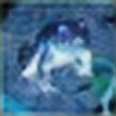
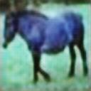
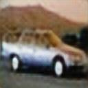
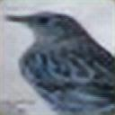

# 画像再構成

SRGANを使ってcifar-10の画像を再構成。

## SRGANと超解像について

- **SRGAN:** これは、生成的敵対的ネットワーク(GAN)の手法を利用して画像の超解像を実現する超解像ネットワークである。

- **超解像:** 通常の画像ズームは小さな画像を大きな画像にすることであるが、これは通常の画像ズームとは異なり、超解像ズームされた画像はより詳細な情報を保持する。
  
  
  
           この画像はここより参照 :https://arxiv.org/abs/1609.04802

## データセット

- **トレーニングデータセット:** この再構成タスクでは[ImageNet](https://www.image-net.org/)の3136枚の画像を使用した。

- **再構築のデータセット :** [CIFAR-10]([CIFAR-10 and CIFAR-100 datasets](https://www.cs.toronto.edu/~kriz/cifar.html))の画像再構成を目指した。

## ファイルについて

- **cifar_10_Dataset_Visualization_.ipynb**
  
   cifar-10データセットから可視化と画像出力を得るためのファイル。

- **ImageReconstruct_SRGAN.ipynb**
  
  このファイルはcifar-10データセットから画像を再構成するためのSRGANアルゴリズムである。

- **InputimagesFromCifar.zip**
  
  このファイルは、再構成が必要なcifar-10データセットの画像である。

- **ImageReconstructed.zip**
  
  このファイルは、cifar-10データセットの入力から再構成された画像である。

## 結果

入力画像と再構成画像は以下のようになる：

**forg:**               **horse:**         

**Auto:**  .           **bird:**    .        
