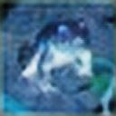
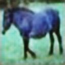
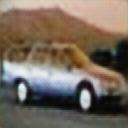
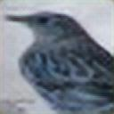

# Reconstruct-Images

Using the SRGAN to reconstruct images of the cifar-10.

## About SRGAN and Super-resolution

- **SRGAN:** it is a super-resolution network that utilizes the method of generative adversarial networks to achieve super-resolution of images.

- **Super-resolution:** it is to turn a small-sized picture into a large-sized picture, but this is not the same as normal picture zoom, super-resolution zoomed picture retains more detail
  
  
  
           This image referenced from :https://arxiv.org/abs/1609.04802

## Data Set

- **Training Data Set:** In this reconstruct task which we have used 3136 images of [ImageNet](https://www.image-net.org/).

- **Reconstruct Data Set :** In this reconstruct task which We aimed to reconstruct images in [CIFAR-10.]([CIFAR-10 and CIFAR-100 datasets](https://www.cs.toronto.edu/~kriz/cifar.html))

## About the files

- **cifar_10_Dataset_Visualization_.ipynb**
  
   This file which is used to get visualization and image output from cifar-10 data set.

- **ImageReconstruct_SRGAN.ipynb**
  
  This file is SRGAN algorithm to reconstruct the images from cifar-10 data set.

- **InputimagesFromCifar.zip**
  
  This file is the images from cifar-10 data set which need to be reconstructed.

- **ImageReconstructed.zip**
  
  This file which is the images what are reconstructed from the input of cifar-10 data set.

## Results

The input images and the reconstructed images like below:

**forg:**               **horse:**         

**Auto:**  .           **bird:**    .        
